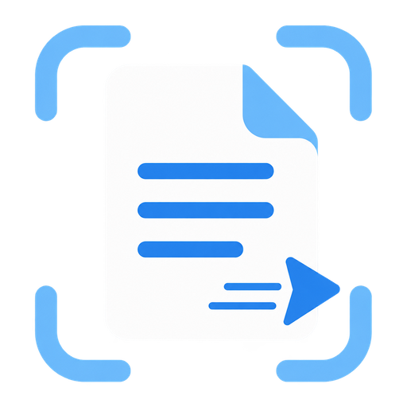
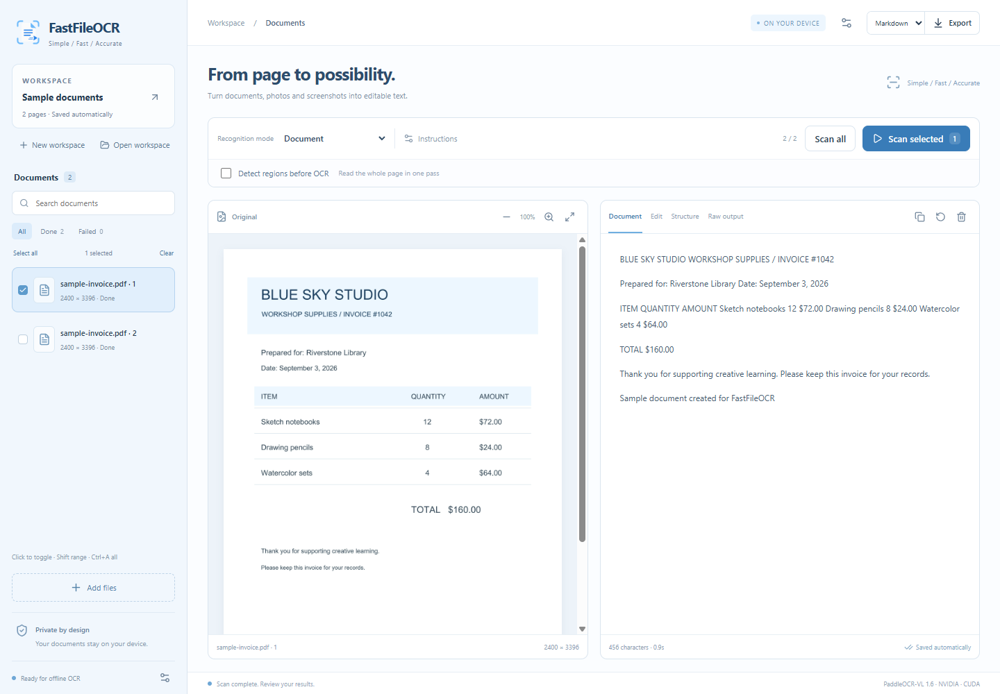
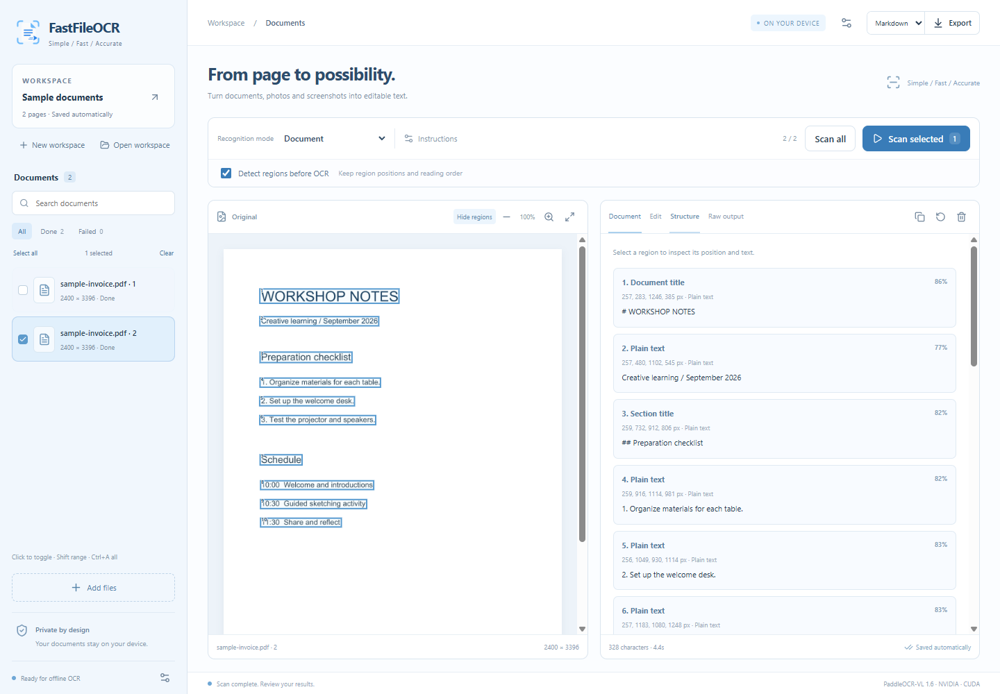
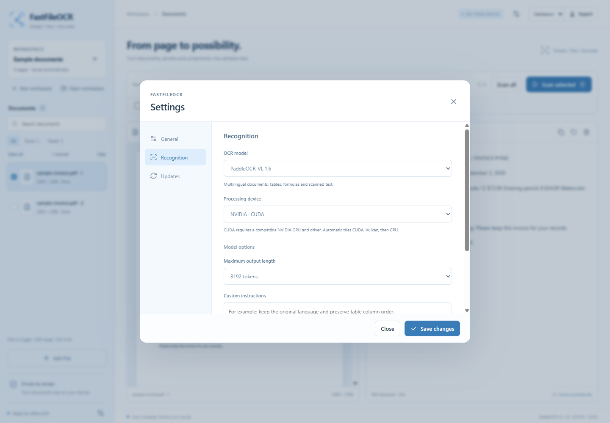

  <a href="README.md">English</a> ·
  <a href="README.ko.md">한국어</a> ·
  <a href="README.ja.md">日本語</a> ·
  <a href="README.zh-CN.md">简体中文</a>

  

<h1 align="center">FastFileOCR</h1>

<strong>Simple / Fast / Accurate</strong>

**FastFileOCR** turns scanned documents, photos and screenshots into editable text on your own Windows PC.

|                    | Support                                                                                                                                                                        |
| ------------------ | ------------------------------------------------------------------------------------------------------------------------------------------------------------------------------ |
| OCR model          | **[PaddleOCR-VL 1.6](https://huggingface.co/PaddlePaddle/PaddleOCR-VL-1.6-GGUF)**, with **PP-DocLayoutV3** for region detection                                                |
| Core language      | **Rust**                                                                                                                                                                       |
| OCR languages      | English, Korean, Japanese, Chinese and more — **[109 languages supported by the model](https://www.paddleocr.ai/main/en/version3.x/algorithm/PaddleOCR-VL/PaddleOCR-VL.html)** |
| App languages      | **English, 한국어, 日本語**                                                                                                                                                    |
| Input files        | **PDF, PNG, JPG/JPEG, WEBP, BMP**, plus clipboard images                                                                                                                       |
| Export formats     | **TXT, Markdown, HTML, JSON**                                                                                                                                                  |
| Platform           | **Windows 10/11 x64**                                                                                                                                                          |
| Processing devices | **Automatic, CPU, Vulkan, NVIDIA CUDA**                                                                                                                                        |

For Word and PowerPoint files, export to PDF before importing. Encrypted PDFs must be unlocked first.

  

## What you can do

- Add PDFs and images by file selection, drag and drop, or **Ctrl+V**.
- Detect regions before OCR to retain positions and reading order. **Enabled by default**; uncheck it for whole-page OCR.
- Recognize documents, plain text, tables, formulas and comics.
- Add custom instructions and rescan any page as often as you need.
- Select multiple pages with Ctrl, Shift or Ctrl+A. Click a selected page again to deselect it.
- Review and edit results, then export text or structured data.

## Get started

1. Download the Windows x64 installer from [Releases](../../releases/latest).
2. Choose your language and a folder for settings, models and workspaces.
3. Open the app, add your files, choose a recognition mode, and scan.

You can try the included [sample document](docs/assets/sample-invoice.pdf).

The first scan downloads approximately **1.82 GB** of OCR models and **133 MB** for region detection from Hugging Face. If region detection is disabled, only the OCR models are needed. Downloads can be paused, stopped and resumed, including after restarting the app. Once the models are ready, OCR runs offline. Your documents and results are not uploaded.

## Regions and document structure

Region detection is enabled by default. Inspect text areas, tables and headings directly on the original page. JSON exports include region coordinates, reading order and individual OCR results.

Region detection can miss stylized titles or unusual layouts; uncheck region detection and rescan the whole page when text is missing. Text and HTML exports follow the reading order; they do not reproduce the original page layout exactly. Comic mode uses recognition instructions and a general document detector, so difficult speech bubbles and reading directions may need another pass.

## Make it yours

Choose **English, 한국어 or 日本語** in Settings. English is the default; the language selected during installation is used on the first launch. The app language is separate from the languages in your documents.

Choose the OCR model, processing device, and model-specific options and instructions. CPU processing works without a dedicated graphics card. CUDA requires a compatible NVIDIA GPU and driver.

Updates can be checked from Settings, with an optional notification at startup. Installing an update lets you keep existing settings or start fresh with a settings backup. Downloaded models and documents are retained. Uninstallation asks separately whether to remove settings and models, and whether to remove workspaces stored inside the app's data folder.

The installer includes the required runtimes; you do not need Rust, Python, Node.js or LM Studio.

## License

Original project code and documentation are licensed under **[CC BY 4.0](LICENSE)**. See [NOTICE.txt](NOTICE.txt) for attribution. Third-party models and libraries retain their own licenses.

[Build and development guide](docs/development/BUILDING.md)
